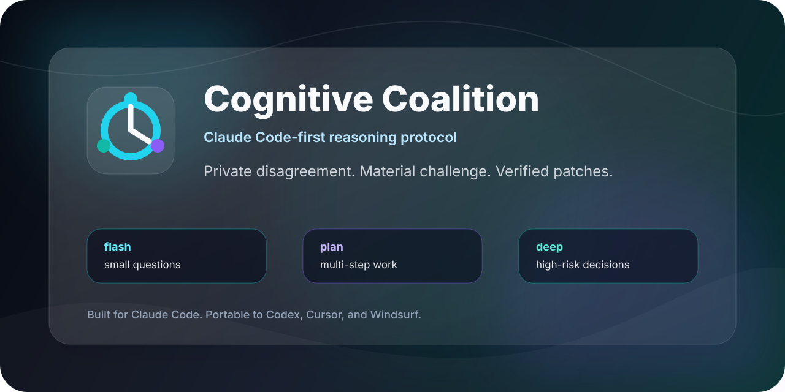

<p align="center">
  
</p>

<h1 align="center">Cognitive Coalition</h1>

<p align="center">
  <strong>A portable reasoning skill that makes AI coding agents plan, challenge, verify, and answer like a compact senior team.</strong>
</p>

<p align="center">
  <a href="https://github.com/dima3005/cognitive-coalition"></a>
  
  
  
  
</p>

<p align="center">
  Private disagreement in. Compact synthesis out.
</p>

---

## Why It Hits Different

Most AI-agent prompts say some version of "think step by step" and hope for the best. That usually creates one of two problems:

- shallow answers that miss the real tradeoff;
- expensive reasoning theater that eats the context window.

**Cognitive Coalition** replaces vague "think harder" instructions with a budgeted operating system for reasoning:

1. choose a mode: `flash`, `plan`, or `deep`;
2. activate only the roles that matter;
3. track facts, assumptions, contested points, decisions, and verification privately;
4. challenge the user only when it materially improves the outcome;
5. return a tight answer that can be acted on.

## What Is New In The Upgraded Version

| Upgrade | What it adds |
| --- | --- |
| Cognitive Ledger | Private tracking for facts, assumptions, contested points, decisions, and verification |
| Scenario Playbooks | Planning, review, architecture, debugging, product, and research output contracts |
| Smarter Prompt CLI | `--scenario`, `--max-words`, target listing, scenario listing, custom roles |
| More Agent Targets | Claude Code, Codex, Cursor, Windsurf, Cline, Aider, Zed, Copilot Chat, generic models |
| Failure Traps | Guards against role theater, premature certainty, context echo, and validation gaps |
| Stronger Challenge Protocol | Push back only on risk, conflict, weak strategy, or wrong optimization target |

## 30-Second Start

Generate a prompt for your agent:

```bash
python3 cognitive-coalition/scripts/coalition_prompt.py --target codex --scenario planning --mode plan
```

Use a scenario when you know the task shape:

```bash
python3 cognitive-coalition/scripts/coalition_prompt.py --target claude-code --scenario architecture --mode deep
python3 cognitive-coalition/scripts/coalition_prompt.py --target cursor --scenario review --mode flash
python3 cognitive-coalition/scripts/coalition_prompt.py --target windsurf --scenario debugging --max-words 700
python3 cognitive-coalition/scripts/coalition_prompt.py --target aider --scenario review --roles critic,architect,security
```

Discover supported options:

```bash
python3 cognitive-coalition/scripts/coalition_prompt.py --list-targets
python3 cognitive-coalition/scripts/coalition_prompt.py --list-scenarios
```

Paste the generated prompt into the agent's project rules, memory, `CLAUDE.md`, `AGENTS.md`, or equivalent instruction file.

## Install As A Codex Skill

Copy the skill folder into your Codex skills directory:

```bash
cp -R cognitive-coalition ~/.codex/skills/
```

Invoke it explicitly:

```text
Use $cognitive-coalition to challenge this architecture and return a verified plan.
```

## Reasoning Modes

| Mode | Best for | Target size |
| --- | --- | --- |
| `flash` | Small questions, obvious edits, status checks | 100-300 words |
| `plan` | Multi-step work, architecture choices, implementation plans | 300-800 words |
| `deep` | Security, migrations, data loss, infrastructure, product-critical decisions | 800-1500 words |

## Scenario Contracts

| Scenario | Output shape |
| --- | --- |
| `planning` | Goal, assumptions, recommended path, risks, plan, verification |
| `review` | Findings first, severity, location, impact, fix |
| `architecture` | Decision, why, alternatives, tradeoffs, next steps |
| `debugging` | Symptom, likely causes, first checks, fix path, verification |
| `product` | User goal, recommended experience, tradeoffs, risks, next action |
| `research` | Known facts, needs verification, evidence, conclusion, action |

## Coalition Roles

| Role | Job |
| --- | --- |
| `builder` | Find the simplest workable implementation |
| `critic` | Attack assumptions, edge cases, regressions, and missing tests |
| `architect` | Check boundaries, interfaces, data flow, and maintainability |
| `security` | Check auth, privacy, injection, secrets, supply chain, and abuse cases |
| `operator` | Check rollout, observability, reversibility, and cost |
| `user-advocate` | Check UX, business goal, copy clarity, and user expectations |
| `maintainer` | Keep the solution understandable and sustainable |
| `researcher` | Decide what needs current evidence before answering |

## Example Generated Prompt

```text
Cognitive Coalition protocol (codex, mode=plan, scenario=planning):
- Follow system, developer, AGENTS.md, and tool instructions first.
- Use roles: builder,critic,architect.
- Keep role debate private; output only the useful synthesis.
- Spend tokens only where disagreement changes the answer.
- First restate the objective in one sentence.
- Track privately: known facts, assumptions, contested points, decision, verification.
- Let each role raise its strongest concern or recommendation.
- Merge duplicates, resolve conflicts with evidence, and choose one path.
- Scenario contract: Return Goal, Assumptions, Recommended path, Risks, ordered Plan, and Verification.
- For code: inspect relevant files before theorizing; verify with tests or commands when feasible.
- For review: lead with concrete findings, severity, and file/line references.
- Challenge the user only when a risk, conflict, or better target materially changes the outcome.
- Stop when more debate would not change the plan.
```

## Project Layout

```text
cognitive-coalition/
|-- SKILL.md                     # Native skill instructions
|-- agents/
|   `-- openai.yaml              # UI metadata for skill loaders
|-- references/
|   |-- adapters.md              # Claude Code, Codex, Cursor, Windsurf, etc.
|   `-- playbooks.md             # Scenario-specific reasoning contracts
`-- scripts/
    `-- coalition_prompt.py      # Portable prompt generator
```

## Design Rules

- Keep role debate private.
- Use tools as evidence, not as more voices.
- Challenge risky assumptions, conflicting requirements, and weak technical strategy.
- Avoid role theater and long named speeches.
- Stop when further disagreement would not change the plan.
- Always include a way to verify the answer when the task is technical.

## Validate Locally

```bash
python3 cognitive-coalition/scripts/coalition_prompt.py --target codex --scenario planning --mode plan
python3 cognitive-coalition/scripts/coalition_prompt.py --list-targets
python3 cognitive-coalition/scripts/coalition_prompt.py --list-scenarios
python3 -m py_compile cognitive-coalition/scripts/coalition_prompt.py
```

If you have Codex's skill validator available:

```bash
python3 ~/.codex/skills/.system/skill-creator/scripts/quick_validate.py cognitive-coalition
```

## Status

Cognitive Coalition is intentionally compact. It is a reasoning protocol, not a framework, so it can live inside real project instructions without consuming the context window it is designed to protect.
